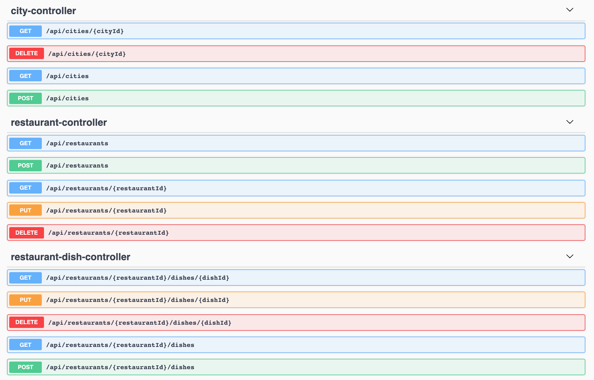
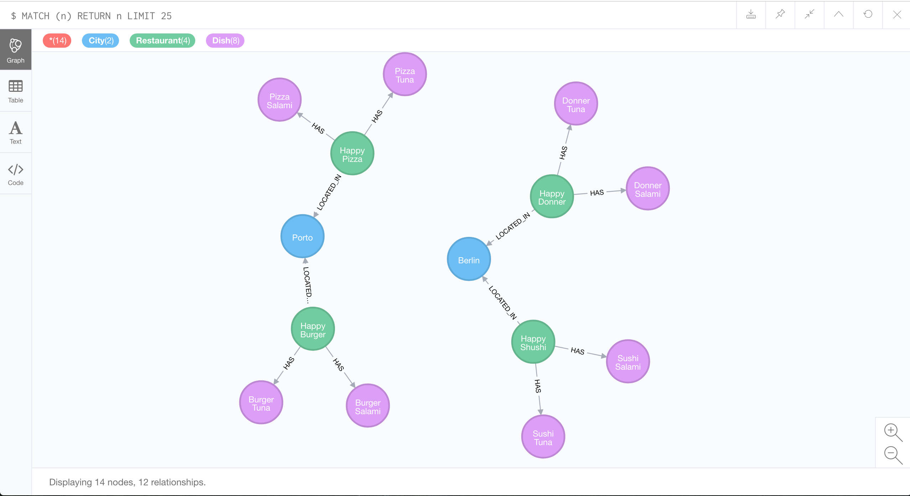
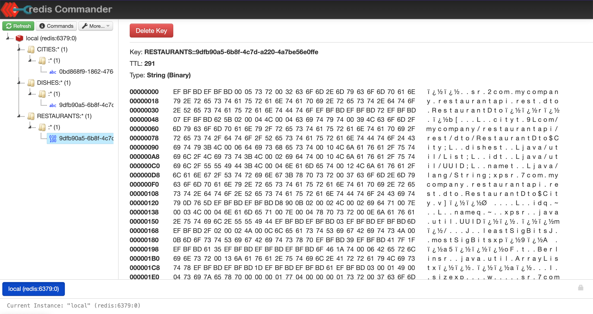

= springboot-caching-neo4j

The goal of this project is to explore how caching works. For it, we are going to implement a simple https://docs.spring.io/spring-boot/docs/current/reference/htmlsingle/[`Spring Boot`] application called `restaurant-api`. We are using https://neo4j.com[`Neo4j`] for storage and, for caching, we can pick one of the following providers: https://docs.spring.io/spring-boot/docs/current/reference/html/spring-boot-features.html#boot-features-caching-provider-simple[`Simple`], https://github.com/ben-manes/caffeine[`Caffeine`] or https://redis.io/[`Redis`].

== Applications

* **restaurant-api**
+
`Spring Boot` Web Java application that has endpoints to manage restaurants, cities (where the restaurants are located in) and dishes that restaurants have. Data is stored in `Neo4j` and caching handled by `Caffeine` or `Redis`.
+

== Caching

The application uses 3 caches: `CITIES`, `RESTAURANTS` and `DISHES`.

The caching is applied at controller level. For instance, if you call `GET /api/restaurants/123` for the first time, the application will check whether the key `123` is present in the `RESTAURANTS` cache; if not, it must go to DB to get the information about the restaurant (payload). Let's say that the payload is

[source]
----
{ "name": "Happy Pizza", "city": {"id": 1, "name": "Berlin"}, "dishes": [] }
----

Before the endpoint finishes and returns the result, the key and its payload are saved in `RESTAURANTS` cache

[source]
----
{ "123" = {"name": "Happy Pizza", "city": {"id": 1, "name": "Berlin"}, "dishes": []} }
----

On subsequents calls to `GET /api/restaurants/123` (and as far as the data is not evicted), the application just needs to go to the cache and get the value.

By the way, we have implemented more advanced caching logic as the one presented above. For example, imagine that you have a city cached in `CITIES` cache and a new restaurant is created in that city. In this case, the cache of the city is evicted of `CITIES` (because the list of restaurants in the city changed) and a new cache for the restaurant is put in `RESTAURANTS` cache. The same happens when a restaurant is deleted/update or a restaurant dish is added/deleted/updated.

== Prerequisites

* https://www.oracle.com/java/technologies/downloads/#java11[`Java 11+`]
* https://www.docker.com/[`Docker`]
* https://docs.docker.com/compose/install/[`Docker-Compose`]
* https://stedolan.github.io/jq[`jq`]

== Start Environment

* Open a terminal and, inside `springboot-caching-neo4j` root folder, run
+
[source]
----
docker-compose up -d
----

* Wait for Docker containers to be up and running. To check it, run
+
[source]
----
docker-compose ps
----

== Running application using Maven

* In a terminal, make sure you are inside `springboot-caching-neo4j` root folder

* Start the application by picking one of the following cache providers
+
** `Simple` cache provider
+
[source]
----
./mvnw clean spring-boot:run --projects restaurant-api
----
+
** `Caffeine` cache provider
+
[source]
----
./mvnw clean spring-boot:run --projects restaurant-api -Dspring-boot.run.profiles=caffeine
----
+
** `Redis` cache provider
+
[source]
----
./mvnw clean spring-boot:run --projects restaurant-api -Dspring-boot.run.profiles=redis
----

== Running application as a Docker container

* Build Docker Image
+
In a terminal, make sure you are in `springboot-caching-neo4j` root folder
+
** JVM
+
[source]
----
./docker-build.sh
----
+
** Native
+
[source]
----
./docker-build.sh native
----

* Environment Variables
+
|===
|Environment Variable |Description

|`SPRING_PROFILES_ACTIVE`
|Specify the type of profile to run the application. To use `Redis` provider for caching set `redis`. To use `Caffeine` for caching set `caffeine`. The default profile will use `Simple` caching.

|`NEO4J_HOST`
|Specify host of the `Neo4j` to use (default `localhost`)

|`NEO4J_PORT`
|Specify port of the `Neo4j` to use (default `7687`)

|`REDIS_HOST`
|Specify host of the `Redis` to use (default `localhost`)

|`REDIS_PORT`
|Specify port of the `Redis` to use (default `6379`)
|===

* Run Docker Container (for instance, using `redis` profile)
+
WARNING: Native is not working yet, see <<Issues>>
+
[source]
----
docker run --rm --name restaurant-api -p 8080:8080 \
  -e SPRING_PROFILES_ACTIVE=redis -e NEO4J_HOST=neo4j -e REDIS_HOST=redis \
  --network=springboot-caching-neo4j_default \
  ivanfranchin/restaurant-api:1.0.0
----

== Application URL

|===
|Application |URL

|restaurant-api
|http://localhost:8080/swagger-ui.html
|===

== Simulation

Open a terminal and run the following commands

* Create a city
+
[source]
----
CITY_ID=$(curl -s -X POST http://localhost:8080/api/cities -H  "Content-Type: application/json" -d '{"name":"Berlin"}' | jq -r .id)

curl -i http://localhost:8080/api/cities/$CITY_ID
----

* Create a restaurant in the city
+
[source]
----
RESTAURANT_ID=$(curl -s -X POST http://localhost:8080/api/restaurants -H  "Content-Type: application/json" -d '{"cityId":"'$CITY_ID'", "name":"Happy Burger"}' | jq -r .id)

curl -i http://localhost:8080/api/restaurants/$RESTAURANT_ID
----

* Create a dish for the restaurant
+
[source]
----
DISH_ID=$(curl -s -X POST http://localhost:8080/api/restaurants/$RESTAURANT_ID/dishes -H  "Content-Type: application/json" -d '{"name":"Cheese Burger", "price":9.99}' | jq -r .id)

curl -i http://localhost:8080/api/restaurants/$RESTAURANT_ID/dishes/$DISH_ID
----

== Checking Caching Statistics

Caching statistics can be obtained by calling `/actuator/prometheus` endpoint

[source]
----
curl -s http://localhost:8080/actuator/prometheus | grep cacheManager
----

== Useful Links

* **Neo4j**
+
`Neo4j` UI can be accessed at http://localhost:7474/browser
+

* **redis-commander**
+
`redis-commander` UI can be accessed at http://localhost:8081
+

== Shutdown

* To stop `restaurant-api` application, go to the terminal where it is running and press `Ctrl+C`
* To stop and remove docker-compose containers, network and volumes, go to a terminal and inside `springboot-caching-neo4j` root folder, run the following command
+
[source]
----
docker-compose down -v
----

== Running Unit And Integration Test Cases

* In a terminal, make sure you are inside `springboot-caching-neo4j` root folder

* Start the tests by picking one on the following cache providers
+
** `Simple` cache provider
+
[source]
----
./mvnw clean verify --projects restaurant-api
----
+
** `Caffeine` cache provider
+
[source]
----
./mvnw clean verify --projects restaurant-api -DargLine="-Dspring.profiles.active=caffeine"
----
+
** `Redis` cache provider
+
[source]
----
./mvnw clean verify --projects restaurant-api -DargLine="-Dspring.profiles.active=redis"
----

== Cleanup

To remove the Docker image created by this project, go to a terminal and run the following command

[source]
----
docker rmi ivanfranchin/restaurant-api:1.0.0
----

== TODO

* Add AOP to log whenever the endpoint is called;
* Create a bash script that uses Neo4j API to insert some data.

== References

* https://docs.spring.io/spring-boot/docs/current/reference/html/spring-boot-features.html#boot-features-caching
* https://github.com/spring-projects/spring-data-neo4j
* https://neo4j.com/developer/spring-data-neo4j/

== Issues

* The Docker native image is built successfully. However, the following exception is thrown at startup. Maybe, caching is still not supported, see [Issue](https://github.com/spring-projects-experimental/spring-native/issues/465)
+
[source]
----
ERROR 1 --- [           main] o.s.boot.SpringApplication               : Application run failed

org.springframework.beans.factory.BeanCreationException: Error creating bean with name 'cacheAutoConfigurationValidator' defined in class path resource [org/springframework/boot/autoconfigure/cache/CacheAutoConfiguration.class]: Invocation of init method failed; nested exception is java.lang.IllegalArgumentException: No cache manager could be auto-configured, check your configuration (caching type is 'REDIS')
	at org.springframework.beans.factory.support.AbstractAutowireCapableBeanFactory.initializeBean(AbstractAutowireCapableBeanFactory.java:1804) ~[na:na]
	at org.springframework.beans.factory.support.AbstractAutowireCapableBeanFactory.doCreateBean(AbstractAutowireCapableBeanFactory.java:620) ~[na:na]
	at org.springframework.beans.factory.support.AbstractAutowireCapableBeanFactory.createBean(AbstractAutowireCapableBeanFactory.java:542) ~[na:na]
	at org.springframework.beans.factory.support.AbstractBeanFactory.lambda$doGetBean$0(AbstractBeanFactory.java:335) ~[na:na]
	at org.springframework.beans.factory.support.DefaultSingletonBeanRegistry.getSingleton(DefaultSingletonBeanRegistry.java:234) ~[na:na]
	at org.springframework.beans.factory.support.AbstractBeanFactory.doGetBean(AbstractBeanFactory.java:333) ~[na:na]
	at org.springframework.beans.factory.support.AbstractBeanFactory.getBean(AbstractBeanFactory.java:208) ~[na:na]
	at org.springframework.beans.factory.support.DefaultListableBeanFactory.preInstantiateSingletons(DefaultListableBeanFactory.java:944) ~[na:na]
	at org.springframework.context.support.AbstractApplicationContext.finishBeanFactoryInitialization(AbstractApplicationContext.java:918) ~[na:na]
	at org.springframework.context.support.AbstractApplicationContext.refresh(AbstractApplicationContext.java:583) ~[na:na]
	at org.springframework.boot.web.servlet.context.ServletWebServerApplicationContext.refresh(ServletWebServerApplicationContext.java:145) ~[na:na]
	at org.springframework.boot.SpringApplication.refresh(SpringApplication.java:754) ~[com.mycompany.restaurantapi.RestaurantApiApplication:2.5.6]
	at org.springframework.boot.SpringApplication.refreshContext(SpringApplication.java:434) ~[com.mycompany.restaurantapi.RestaurantApiApplication:2.5.6]
	at org.springframework.boot.SpringApplication.run(SpringApplication.java:338) ~[com.mycompany.restaurantapi.RestaurantApiApplication:2.5.6]
	at org.springframework.boot.SpringApplication.run(SpringApplication.java:1343) ~[com.mycompany.restaurantapi.RestaurantApiApplication:2.5.6]
	at org.springframework.boot.SpringApplication.run(SpringApplication.java:1332) ~[com.mycompany.restaurantapi.RestaurantApiApplication:2.5.6]
	at com.mycompany.restaurantapi.RestaurantApiApplication.main(RestaurantApiApplication.java:21) ~[com.mycompany.restaurantapi.RestaurantApiApplication:na]
Caused by: java.lang.IllegalArgumentException: No cache manager could be auto-configured, check your configuration (caching type is 'REDIS')
	at org.springframework.util.Assert.notNull(Assert.java:219) ~[na:na]
	at org.springframework.boot.autoconfigure.cache.CacheAutoConfiguration$CacheManagerValidator.afterPropertiesSet(CacheAutoConfiguration.java:109) ~[com.mycompany.restaurantapi.RestaurantApiApplication:2.5.6]
	at org.springframework.beans.factory.support.AbstractAutowireCapableBeanFactory.invokeInitMethods(AbstractAutowireCapableBeanFactory.java:1863) ~[na:na]
	at org.springframework.beans.factory.support.AbstractAutowireCapableBeanFactory.initializeBean(AbstractAutowireCapableBeanFactory.java:1800) ~[na:na]
	... 16 common frames omitted
----
