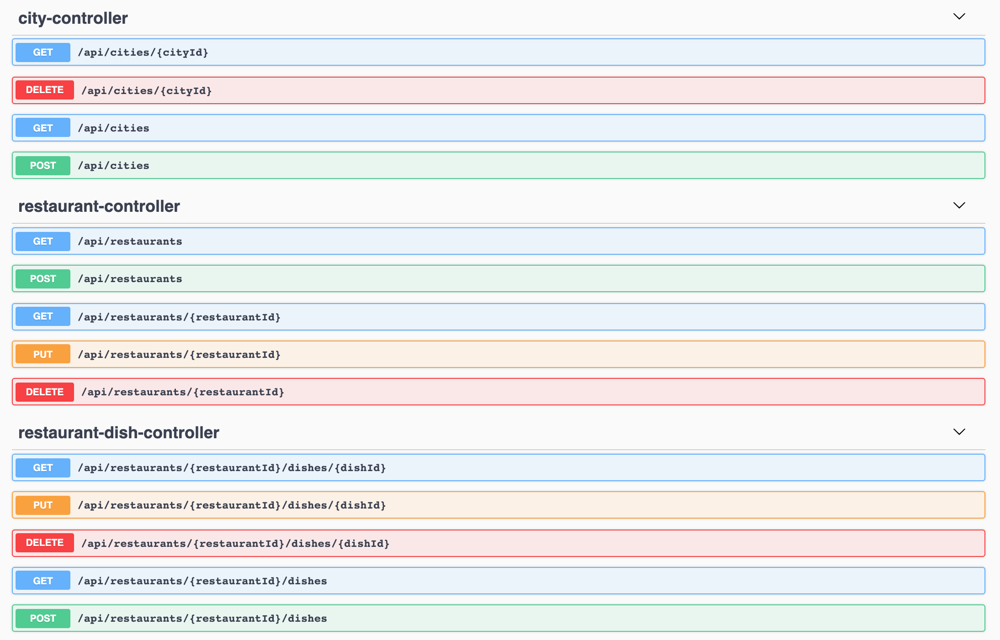
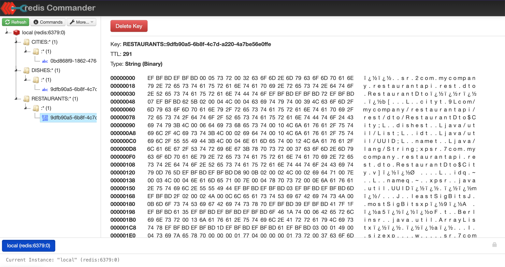

= springboot-caching-neo4j

The goal of this project is to explore how caching works. For it, we are going to implement a simple https://docs.spring.io/spring-boot/docs/current/reference/htmlsingle/[`Spring Boot`] application called `restaurant-api`. We are using https://neo4j.com[`Neo4j`] for storage and, for caching, we can pick one of the following providers: https://docs.spring.io/spring-boot/docs/current/reference/html/spring-boot-features.html#boot-features-caching-provider-simple[`Simple`], https://github.com/ben-manes/caffeine[`Caffeine`] or https://redis.io/[`Redis`].

== Applications

* **restaurant-api**
+
`Spring Boot` Web Java application that has endpoints to manage restaurants, cities (where the restaurants are located in) and dishes that restaurants have. Data is stored in `Neo4j` and caching handled by `Caffeine` or `Redis`.
+

== Caching

The application uses 3 caches: `CITIES`, `RESTAURANTS` and `DISHES`.

The caching is applied at controller level. For instance, if you call `GET /api/restaurants/123` for the first time, the application will check whether the key `123` is present in the `RESTAURANTS` cache; if not, it must go to DB to get the information about the restaurant (payload). Let's say that the payload is

[source]
----
{
    "name": "Happy Pizza", "city": {"id": 1, "name": "Berlin"}, "dishes": []
}
----

Before the endpoint finishes and returns the result, the key and its payload are saved in `RESTAURANTS` cache

[source]
----
{
    "123" = {"name": "Happy Pizza", "city": {"id": 1, "name": "Berlin"}, "dishes": []}
}
----

On subsequents calls to `GET /api/restaurants/123` (and as far as the data is not evicted), the application just needs to go to the cache and get the value.

By the way, we have implemented more advanced caching logic as the one presented above. For example, imagine that you have a city cached in `CITIES` cache and a new restaurant is created in that city. In this case, the cache of the city is evicted of `CITIES` (because the list of restaurants in the city changed) and a new cache for the restaurant is put in `RESTAURANTS` cache. The same happens when a restaurant is deleted/update or a restaurant dish is added/deleted/updated.

== Prerequisites

* https://www.oracle.com/java/technologies/javase-jdk11-downloads.html[`Java 11+`]
* https://www.docker.com/[`Docker`]
* https://docs.docker.com/compose/install/[`Docker-Compose`]
* https://stedolan.github.io/jq[`jq`]

== Start Environment

* Open a terminal and, inside `springboot-caching-neo4j` root folder, run
+
[source]
----
docker-compose up -d
----

* Wait until docker containers be up and healthy. To check it, run
+
[source]
----
docker-compose ps
----

== Running application using Maven

* In a terminal, make sure you are inside `springboot-caching-neo4j` root folder

* Start the application by picking one on the following cache providers
+
** `Simple` cache provider
+
[source]
----
./mvnw clean spring-boot:run --projects restaurant-api
----
+
** `Caffeine` cache provider
+
[source]
----
./mvnw clean spring-boot:run --projects restaurant-api -Dspring-boot.run.profiles=caffeine
----
+
** `Redis` cache provider
+
[source]
----
./mvnw clean spring-boot:run --projects restaurant-api -Dspring-boot.run.profiles=redis
----

== Running application as a Docker container

* Build Docker Image
+
** JVM
+
[source]
----
./docker-build.sh
----
+
** Native (it's not working yet, see <<Issues>>)
+
[source]
----
./docker-build.sh native
----

* Environment Variables
+
|===
|Environment Variable |Description

|SPRING_PROFILES_ACTIVE
|Specify the type of profile to run the application. To use `Redis` provider for caching set `redis`. To use `Caffeine` for caching set `caffeine`. The default profile will use `Simple` caching.

|NEO4J_HOST
|Specify host of the `Neo4j` to use (default `localhost`)

|NEO4J_PORT
|Specify port of the `Neo4j` to use (default `7687`)

|REDIS_HOST
|Specify host of the `Redis` to use (default `localhost`)

|REDIS_PORT
|Specify port of the `Redis` to use (default `6379`)
|===

* Run `restaurant-api` docker container (for instance, using `redis` profile), joining it to docker-compose network
+
[source]
----
docker run -d --rm -p 8080:8080 --name restaurant-api \
  --env NEO4J_HOST=neo4j --env REDIS_HOST=redis --env SPRING_PROFILES_ACTIVE=redis \
  --network=springboot-caching-neo4j_default \
  docker.mycompany.com/restaurant-api:1.0.0
----

== Application URL

|===
|Application |URL

|restaurant-api
|http://localhost:8080/swagger-ui.html
|===

== Simulation

Open a terminal and run the following commands

* Create a city
+
[source]
----
CITY_ID=$(curl -s -X POST http://localhost:8080/api/cities -H  "Content-Type: application/json" -d '{"name":"Berlin"}' | jq -r .id)

curl -i http://localhost:8080/api/cities/$CITY_ID
----

* Create a restaurant in the city
+
[source]
----
RESTAURANT_ID=$(curl -s -X POST http://localhost:8080/api/restaurants -H  "Content-Type: application/json" -d '{"cityId":"'$CITY_ID'", "name":"Happy Burger"}' | jq -r .id)

curl -i http://localhost:8080/api/restaurants/$RESTAURANT_ID
----

* Create a dish for the restaurant
+
[source]
----
DISH_ID=$(curl -s -X POST http://localhost:8080/api/restaurants/$RESTAURANT_ID/dishes -H  "Content-Type: application/json" -d '{"name":"Cheese Burger", "price":9.99}' | jq -r .id)

curl -i http://localhost:8080/api/restaurants/$RESTAURANT_ID/dishes/$DISH_ID
----

== Checking Caching Statistics

Caching statistics can be obtained by calling `/actuator/prometheus` endpoint

[source]
----
curl -s http://localhost:8080/actuator/prometheus | grep cacheManager
----

== Useful Links

* **Neo4j**
+
`Neo4j` UI can be accessed at http://localhost:7474/browser
+
image::images/neo4j-ui.png[]

* **redis-commander**
+
`redis-commander` UI can be accessed at http://localhost:8081
+

== Shutdown

* To stop `restaurant-api` application
+
** If it was started with `Maven`, go to the terminal where it is running and press `Ctrl+C`
** If it was started as a Docker container, run in a terminal the command below
+
[source]
----
docker stop simple-service
----

* To stop and remove docker-compose containers, networks and volumes, in a terminal and inside `springboot-caching-neo4j` root folder, run the following command
+
[source]
----
docker-compose down -v
----

== Running Unit And Integration Test Cases

* In a terminal, make sure you are inside `springboot-caching-neo4j` root folder

* Start the tests by picking one on the following cache providers
+
** `Simple` cache provider
+
[source]
----
./mvnw clean verify
----
+
** `Caffeine` cache provider
+
[source]
----
./mvnw clean verify -DargLine="-Dspring.profiles.active=caffeine"
----
+
** `Redis` cache provider
+
[source]
----
./mvnw clean verify -DargLine="-Dspring.profiles.active=redis"
----

== Generating missing configuration for native image

IMPORTANT: You must have `GraalVM` and its tool `native-image` installed.

TIP: For more information see https://docs.spring.io/spring-native/docs/current/reference/htmlsingle/#_missing_configuration[Spring Native documentation]

- Run the following steps in a terminal and inside `springboot-caching-neo4j` root folder
+
[source]
----
mkdir -p restaurant-api/src/main/resources/META-INF/native-image

./mvnw clean package --projects restaurant-api -DskipTests

cd restaurant-api

java -jar -agentlib:native-image-agent=config-output-dir=src/main/resources/META-INF/native-image -Dserver.port=9080 target/restaurant-api-1.0.0.jar
----

- It should generate `JSON` files in `src/main/resources/META-INF/native-image` like `jni-config.json`, `proxy-config.json` etc.

== TODO

* Add AOP to log whenever the endpoint is called;
* Create a bash script that uses Neo4j API to insert some data.

== Issues

* If the missing configuration for native image is generated using the `native-image-agent`, it's throwing the following error while building the Docker native image. It's fixed in this {issue #2951](https://github.com/oracle/graal/issues/2951). Waiting for `GraalVM 21.1` milestone be completed/released
+
[source]
----
...
[INFO]     [creator]     Error: type is not available in this platform: org.graalvm.compiler.hotspot.management.AggregatedMemoryPoolBean
[INFO]     [creator]     Error: Use -H:+ReportExceptionStackTraces to print stacktrace of underlying exception
[INFO]     [creator]     Error: Image build request failed with exit status 1
[INFO]     [creator]     unable to invoke layer creator
[INFO]     [creator]     unable to contribute native-image layer
[INFO]     [creator]     error running build
[INFO]     [creator]     exit status 1
[INFO]     [creator]     ERROR: failed to build: exit status 1
...
----

* If the missing configuration is NOT generated, the following exception is thrown while building the Docker native image
+
[source]
----
[INFO]     [creator]     2 fatal errors detected:
[INFO]     [creator]     Fatal error:java.lang.NoClassDefFoundError: javax/cache/annotation/CacheMethodDetails
[INFO]     [creator]     	at java.base/java.lang.ClassLoader.defineClass1(Native Method)
[INFO]     [creator]     	at java.base/java.lang.ClassLoader.defineClass(ClassLoader.java:1017)
[INFO]     [creator]     	at java.base/java.security.SecureClassLoader.defineClass(SecureClassLoader.java:174)
[INFO]     [creator]     	at java.base/java.net.URLClassLoader.defineClass(URLClassLoader.java:550)
[INFO]     [creator]     	at java.base/java.net.URLClassLoader$1.run(URLClassLoader.java:458)
[INFO]     [creator]     	at java.base/java.net.URLClassLoader$1.run(URLClassLoader.java:452)
[INFO]     [creator]     	at java.base/java.security.AccessController.doPrivileged(Native Method)
[INFO]     [creator]     	at java.base/java.net.URLClassLoader.findClass(URLClassLoader.java:451)
[INFO]     [creator]     	at java.base/java.lang.ClassLoader.loadClass(ClassLoader.java:589)
[INFO]     [creator]     	at java.base/java.lang.ClassLoader.loadClass(ClassLoader.java:522)
[INFO]     [creator]     	at java.base/java.lang.ClassLoader.defineClass1(Native Method)
[INFO]     [creator]     	at java.base/java.lang.ClassLoader.defineClass(ClassLoader.java:1017)
[INFO]     [creator]     	at java.base/java.security.SecureClassLoader.defineClass(SecureClassLoader.java:174)
[INFO]     [creator]     	at java.base/java.net.URLClassLoader.defineClass(URLClassLoader.java:550)
[INFO]     [creator]     	at java.base/java.net.URLClassLoader$1.run(URLClassLoader.java:458)
[INFO]     [creator]     	at java.base/java.net.URLClassLoader$1.run(URLClassLoader.java:452)
[INFO]     [creator]     	at java.base/java.security.AccessController.doPrivileged(Native Method)
[INFO]     [creator]     	at java.base/java.net.URLClassLoader.findClass(URLClassLoader.java:451)
[INFO]     [creator]     	at java.base/java.lang.ClassLoader.loadClass(ClassLoader.java:589)
[INFO]     [creator]     	at java.base/java.lang.ClassLoader.loadClass(ClassLoader.java:522)
[INFO]     [creator]     	at java.base/java.lang.Class.forName0(Native Method)
[INFO]     [creator]     	at java.base/java.lang.Class.forName(Class.java:398)
[INFO]     [creator]     	at java.base/sun.reflect.generics.factory.CoreReflectionFactory.makeNamedType(CoreReflectionFactory.java:114)
[INFO]     [creator]     	at java.base/sun.reflect.generics.visitor.Reifier.visitClassTypeSignature(Reifier.java:125)
[INFO]     [creator]     	at java.base/sun.reflect.generics.tree.ClassTypeSignature.accept(ClassTypeSignature.java:49)
[INFO]     [creator]     	at java.base/sun.reflect.generics.reflectiveObjects.LazyReflectiveObjectGenerator.reifyBounds(LazyReflectiveObjectGenerator.java:65)
[INFO]     [creator]     	at java.base/sun.reflect.generics.reflectiveObjects.TypeVariableImpl.getBounds(TypeVariableImpl.java:125)
[INFO]     [creator]     	at com.oracle.svm.core.hub.GuardedBoundsAccess.getBounds(SunReflectTypeSubstitutions.java:298)
[INFO]     [creator]     	at com.oracle.svm.core.hub.TypeVariableBoundsComputer.compute(SunReflectTypeSubstitutions.java:139)
[INFO]     [creator]     	at com.oracle.svm.hosted.substitute.ComputedValueField.readValue(ComputedValueField.java:269)
[INFO]     [creator]     	at com.oracle.svm.core.meta.ReadableJavaField.readFieldValue(ReadableJavaField.java:35)
[INFO]     [creator]     	at com.oracle.svm.hosted.ameta.AnalysisConstantReflectionProvider.readValue(AnalysisConstantReflectionProvider.java:99)
[INFO]     [creator]     	at com.oracle.svm.hosted.ameta.AnalysisConstantReflectionProvider.readFieldValue(AnalysisConstantReflectionProvider.java:78)
[INFO]     [creator]     	at com.oracle.graal.pointsto.ObjectScanner.scanField(ObjectScanner.java:178)
[INFO]     [creator]     	at com.oracle.graal.pointsto.ObjectScanner.doScan(ObjectScanner.java:346)
[INFO]     [creator]     	at com.oracle.graal.pointsto.ObjectScanner.access$400(ObjectScanner.java:60)
[INFO]     [creator]     	at com.oracle.graal.pointsto.ObjectScanner$2$1.run(ObjectScanner.java:388)
[INFO]     [creator]     	at com.oracle.graal.pointsto.util.CompletionExecutor.lambda$execute$0(CompletionExecutor.java:173)
[INFO]     [creator]     	at java.base/java.util.concurrent.ForkJoinTask$RunnableExecuteAction.exec(ForkJoinTask.java:1426)
[INFO]     [creator]     	at java.base/java.util.concurrent.ForkJoinTask.doExec(ForkJoinTask.java:290)
[INFO]     [creator]     	at java.base/java.util.concurrent.ForkJoinPool$WorkQueue.topLevelExec(ForkJoinPool.java:1020)
[INFO]     [creator]     	at java.base/java.util.concurrent.ForkJoinPool.scan(ForkJoinPool.java:1656)
[INFO]     [creator]     	at java.base/java.util.concurrent.ForkJoinPool.runWorker(ForkJoinPool.java:1594)
[INFO]     [creator]     	at java.base/java.util.concurrent.ForkJoinWorkerThread.run(ForkJoinWorkerThread.java:183)
[INFO]     [creator]     Caused by: java.lang.ClassNotFoundException: javax.cache.annotation.CacheMethodDetails
[INFO]     [creator]     	at java.base/java.net.URLClassLoader.findClass(URLClassLoader.java:471)
[INFO]     [creator]     	at java.base/java.lang.ClassLoader.loadClass(ClassLoader.java:589)
[INFO]     [creator]     	at java.base/java.lang.ClassLoader.loadClass(ClassLoader.java:522)
[INFO]     [creator]     	... 44 more
[INFO]     [creator]     Fatal error:java.lang.NoClassDefFoundError: javax/cache/annotation/CacheMethodDetails
[INFO]     [creator]     	at java.base/java.lang.ClassLoader.defineClass1(Native Method)
[INFO]     [creator]     	at java.base/java.lang.ClassLoader.defineClass(ClassLoader.java:1017)
[INFO]     [creator]     	at java.base/java.security.SecureClassLoader.defineClass(SecureClassLoader.java:174)
[INFO]     [creator]     	at java.base/java.net.URLClassLoader.defineClass(URLClassLoader.java:550)
[INFO]     [creator]     	at java.base/java.net.URLClassLoader$1.run(URLClassLoader.java:458)
[INFO]     [creator]     	at java.base/java.net.URLClassLoader$1.run(URLClassLoader.java:452)
[INFO]     [creator]     	at java.base/java.security.AccessController.doPrivileged(Native Method)
[INFO]     [creator]     	at java.base/java.net.URLClassLoader.findClass(URLClassLoader.java:451)
[INFO]     [creator]     	at java.base/java.lang.ClassLoader.loadClass(ClassLoader.java:589)
[INFO]     [creator]     	at java.base/java.lang.ClassLoader.loadClass(ClassLoader.java:522)
[INFO]     [creator]     	at java.base/java.lang.ClassLoader.defineClass1(Native Method)
[INFO]     [creator]     	at java.base/java.lang.ClassLoader.defineClass(ClassLoader.java:1017)
[INFO]     [creator]     	at java.base/java.security.SecureClassLoader.defineClass(SecureClassLoader.java:174)
[INFO]     [creator]     	at java.base/java.net.URLClassLoader.defineClass(URLClassLoader.java:550)
[INFO]     [creator]     	at java.base/java.net.URLClassLoader$1.run(URLClassLoader.java:458)
[INFO]     [creator]     	at java.base/java.net.URLClassLoader$1.run(URLClassLoader.java:452)
[INFO]     [creator]     	at java.base/java.security.AccessController.doPrivileged(Native Method)
[INFO]     [creator]     	at java.base/java.net.URLClassLoader.findClass(URLClassLoader.java:451)
[INFO]     [creator]     	at java.base/java.lang.ClassLoader.loadClass(ClassLoader.java:589)
[INFO]     [creator]     	at java.base/java.lang.ClassLoader.loadClass(ClassLoader.java:522)
[INFO]     [creator]     	at java.base/java.lang.Class.forName0(Native Method)
[INFO]     [creator]     	at java.base/java.lang.Class.forName(Class.java:398)
[INFO]     [creator]     	at java.base/sun.reflect.generics.factory.CoreReflectionFactory.makeNamedType(CoreReflectionFactory.java:114)
[INFO]     [creator]     	at java.base/sun.reflect.generics.visitor.Reifier.visitClassTypeSignature(Reifier.java:125)
[INFO]     [creator]     	at java.base/sun.reflect.generics.tree.ClassTypeSignature.accept(ClassTypeSignature.java:49)
[INFO]     [creator]     	at java.base/sun.reflect.generics.reflectiveObjects.LazyReflectiveObjectGenerator.reifyBounds(LazyReflectiveObjectGenerator.java:65)
[INFO]     [creator]     	at java.base/sun.reflect.generics.reflectiveObjects.TypeVariableImpl.getBounds(TypeVariableImpl.java:125)
[INFO]     [creator]     	at com.oracle.svm.core.hub.GuardedBoundsAccess.getBounds(SunReflectTypeSubstitutions.java:298)
[INFO]     [creator]     	at com.oracle.svm.core.hub.TypeVariableBoundsComputer.compute(SunReflectTypeSubstitutions.java:139)
[INFO]     [creator]     	at com.oracle.svm.hosted.substitute.ComputedValueField.readValue(ComputedValueField.java:269)
[INFO]     [creator]     	at com.oracle.svm.core.meta.ReadableJavaField.readFieldValue(ReadableJavaField.java:35)
[INFO]     [creator]     	at com.oracle.svm.hosted.ameta.AnalysisConstantReflectionProvider.readValue(AnalysisConstantReflectionProvider.java:99)
[INFO]     [creator]     	at com.oracle.svm.hosted.ameta.AnalysisConstantReflectionProvider.readFieldValue(AnalysisConstantReflectionProvider.java:78)
[INFO]     [creator]     	at com.oracle.graal.pointsto.ObjectScanner.scanField(ObjectScanner.java:178)
[INFO]     [creator]     	at com.oracle.graal.pointsto.ObjectScanner.doScan(ObjectScanner.java:346)
[INFO]     [creator]     	at com.oracle.graal.pointsto.ObjectScanner.access$400(ObjectScanner.java:60)
[INFO]     [creator]     	at com.oracle.graal.pointsto.ObjectScanner$2$1.run(ObjectScanner.java:388)
[INFO]     [creator]     	at com.oracle.graal.pointsto.util.CompletionExecutor.lambda$execute$0(CompletionExecutor.java:173)
[INFO]     [creator]     	at java.base/java.util.concurrent.ForkJoinTask$RunnableExecuteAction.exec(ForkJoinTask.java:1426)
[INFO]     [creator]     	at java.base/java.util.concurrent.ForkJoinTask.doExec(ForkJoinTask.java:290)
[INFO]     [creator]     	at java.base/java.util.concurrent.ForkJoinPool$WorkQueue.topLevelExec(ForkJoinPool.java:1020)
[INFO]     [creator]     	at java.base/java.util.concurrent.ForkJoinPool.scan(ForkJoinPool.java:1656)
[INFO]     [creator]     	at java.base/java.util.concurrent.ForkJoinPool.runWorker(ForkJoinPool.java:1594)
[INFO]     [creator]     	at java.base/java.util.concurrent.ForkJoinWorkerThread.run(ForkJoinWorkerThread.java:183)
[INFO]     [creator]     Caused by: java.lang.ClassNotFoundException: javax.cache.annotation.CacheMethodDetails
[INFO]     [creator]     	at java.base/java.net.URLClassLoader.findClass(URLClassLoader.java:471)
[INFO]     [creator]     	at java.base/java.lang.ClassLoader.loadClass(ClassLoader.java:589)
[INFO]     [creator]     	at java.base/java.lang.ClassLoader.loadClass(ClassLoader.java:522)
[INFO]     [creator]     	... 44 more
[INFO]     [creator]     Error: Image build request failed with exit status 1
[INFO]     [creator]     unable to invoke layer creator
[INFO]     [creator]     unable to contribute native-image layer
[INFO]     [creator]     error running build
[INFO]     [creator]     exit status 1
[INFO]     [creator]     ERROR: failed to build: exit status 1
----

== Reference

* https://docs.spring.io/spring-boot/docs/current/reference/html/spring-boot-features.html#boot-features-caching
* https://github.com/spring-projects/spring-data-neo4j
* https://neo4j.com/developer/spring-data-neo4j/
